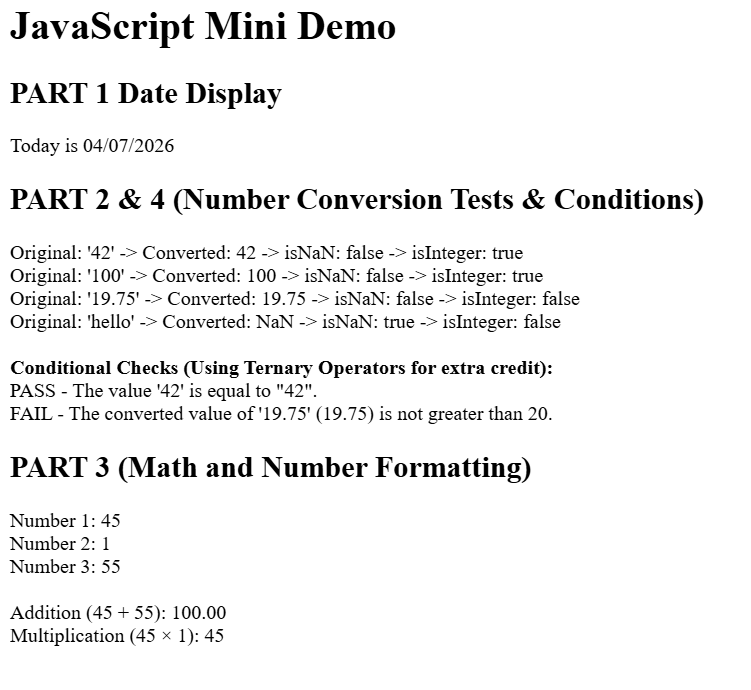

# JavaScript Mini Demo

JavaScript webpage for COMP 484 homework 9. Date formatting, number checking, and some basic math.

## Live Demo

**[Check it out here](https://eberteogam.github.io/HW9JavaScript/)**

---

## What I Used

**Date Object**
- `Date()` - gets todays date
- `getMonth()` - gets the month
- `getDate()` - day of the month
- `getFullYear()` - the year

**Number Object**
- `Number()` - converts strings to numbers
- `Number.isNaN()` - checks if something is NaN
- `Number.isInteger()` - checks if its a whole number
- `toFixed()` - rounds numbers to decimal places
- `toLocaleString()` - formats numbers with commas and stuff

**DOM stuff**
- `document.getElementById()` - grabs elements by ID
- `textContent` - sets text in an element
- `innerHTML` - puts HTML content in an element

---

## Screenshot

---

## What I Learned

**Easiest part?**
The date section was pretty straightforward. 
Just grab the date, pull out the numbers, and format it. 

**Hardest part?**
The number conversion section was kinda annoying because
I had to repeat the same thing 4 times for different variables.

**Date object**
Learned that months start at 0. So January is 0 and December is 11. 
Got confused at first but once you add 1 to getMonth() it's fine. 

**Number object**
The `Number()` function is handy for converting strings but 
it returns NaN if the string isn't actually a number, which is good for error checking. 
`isNaN()` and `isInteger()` make it easy to validate numbers.
`toFixed()` is clutch for displaying prices correctly with 2 decimal places.

---

## Files

- index.html
- script.js
- README.md
- img.png

---

**Submitted April 2, 2026**

